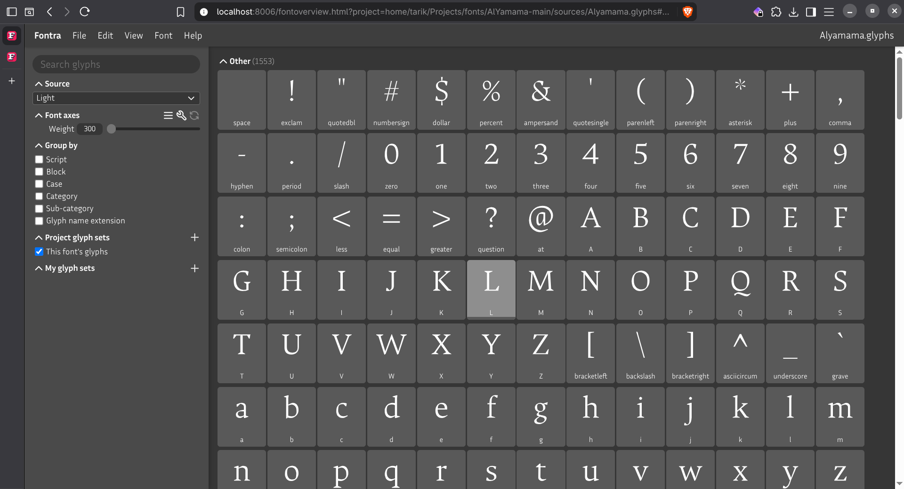

# Fontra Flatpak
## Flatpak repository for Fontra



### Installation 
* If Flatpak is not already enabled on your Linux distribution, follow [these instructions](https://flatpak.org/setup/) for your distribution to enable it.
* If Flatpak is integrated with your Software Center (as in Fedora Workstation or Manjaro), download [`xyz.fontra.FontraPak.flatpakref`](https://fontra.github.io/fontra-flatpak/xyz.fontra.FontraPak.flatpakref), right-click it, and select **Open with -> Software Install**.
* Otherwise, copy and paste the following command into your terminal:

```bash
flatpak install --from https://fontra.github.io/fontra-flatpak/xyz.fontra.FontraPak.flatpakref
```
* Type Y for yes and provide your password when prompted
* Fontrapak with all its dependancy will be installed in your computer

### Update
* If Fontrapak is showing in your Software centre, you can press the "Update" button to update to the latest version.
* Otherwise. open your terminal and type
```bash
flatpak update xyz.fontra.FontraPak
```
### Running Fontra Flatpak
* In terminal, start the application by typing
```bash
flatpak run xyz.fontra.FontraPak
```
* Alternatively, open your app menu app menu and click on the Fontra icon 

### Known Issues 
 The flatpak is reported to be working slowly in some distros like Debian Trixie where the base Ubuntu binary is working fine. We are currently investigating the issue.
 
For any other problem, please [open an Issue](https://github.com/fontra/fontra-flatpak/issues)
